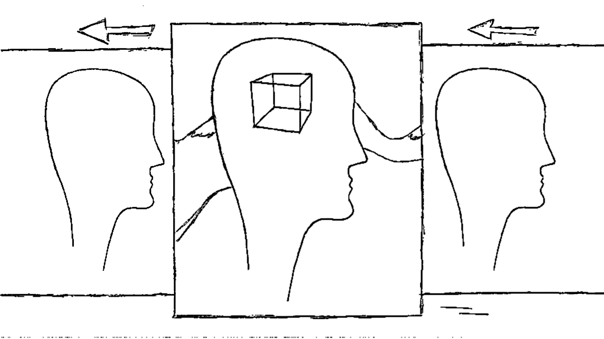

# DN2A #

## Dynamic Neural Networks Architecture ##

## About ##

A <a href="https://github.com/antoniodeluca/dn2a/tree/main/library">library</a>, <a href="https://github.com/antoniodeluca/dn2a/tree/main/workspace">workspace</a> and vision around neural networks.

### A vision called Perception ###

